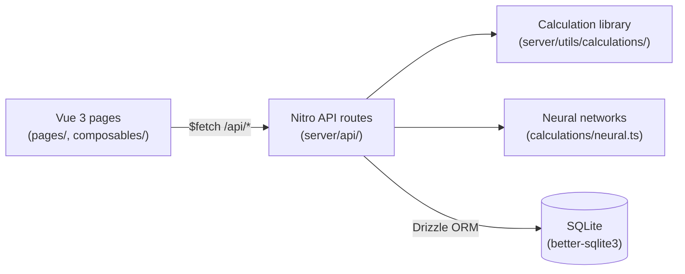
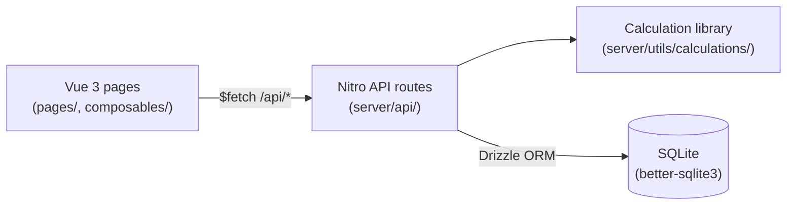

# BrewBuddyNG — Technical documentation

> [!WARNING]
> **This application was rebuilt entirely with GitHub Copilot and has NOT been tested properly.**
> Calculations may contain errors. Do not use in production without independent verification.
> Repository: <https://github.com/JoostVoskuil/brewbuddyng>

This document is the developer-facing guide for BrewBuddyNG. For non-developer install instructions,
see the [README](../README.md).

## Table of contents

- [Architecture overview](#architecture-overview)
- [Local development setup](#local-development-setup)
- [Project structure](#project-structure)
- [Pages & routes](#pages--routes)
- [Components](#components)
- [Composables](#composables)
- [Server layer](#server-layer)
  - [CRUD factories](#crud-factories)
  - [Validation](#validation)
  - [Recipes and brews](#recipes-and-brews)
- [Calculation library](#calculation-library)
- [Database schema](#database-schema)
- [API reference](#api-reference)
- [Configuration](#configuration)
- [Testing](#testing)
- [Linting and formatting](#linting-and-formatting)
- [CI/CD](#cicd)
- [Building and deployment](#building-and-deployment)

## Architecture overview

BrewBuddyNG is a single Nuxt 4 application that serves both the Vue 3 front end and a Nitro-based
REST API from one process.



Key design points:

- **One process, file-based routing.** Pages under `pages/` and API handlers under `server/api/`
  are auto-routed by Nuxt/Nitro.
- **Shared types.** Domain types are inferred directly from the Drizzle schema in
  [`types/index.ts`](../types/index.ts), so the database is the single source of truth.
- **Validated boundaries.** Every write endpoint validates its body with Zod schemas derived from
  the schema via `drizzle-zod` (see [`server/utils/validation.ts`](../server/utils/validation.ts)).
- **DRY CRUD.** Simple resource endpoints are generated by factory helpers in
  [`server/utils/crud.ts`](../server/utils/crud.ts).
- **Bilingual UI.** English and Dutch i18n via `@nuxtjs/i18n`; Dutch is the default locale.
- **Neural network predictions.** Optional ML-based fermentation outcome prediction built on brew
  measurement history.

## Local development setup

Prerequisites: **Node.js 22+** and npm.

```bash
npm install          # installs deps and runs `nuxt prepare`
npm run db:seed      # optional: load standard ingredient data into ./data/brewbuddy.db
npm run dev          # start dev server at http://localhost:3000
```

Useful scripts (defined in [`package.json`](../package.json)):

| Script                | Purpose                              |
| --------------------- | ------------------------------------ |
| `npm run dev`         | Dev server with hot reload           |
| `npm run build`       | Production build (`.output/`)        |
| `npm run preview`     | Preview the production build         |
| `npm run db:seed`     | Seed the database from `seed/*.xml`  |
| `npm run db:generate` | Generate Drizzle migrations          |
| `npm run db:migrate`  | Apply Drizzle migrations             |
| `npm run lint`        | Run ESLint                           |
| `npm run lint:fix`    | Run ESLint with autofix              |
| `npm run format`      | Format all files with Prettier       |
| `npm run typecheck`   | Type-check with `vue-tsc`            |
| `npm run test`        | Run Vitest in watch mode             |
| `npm run test:run`    | Run the test suite once (used in CI) |

## Project structure

```
app.vue                  # Root component
nuxt.config.ts           # Nuxt configuration
drizzle.config.ts        # Drizzle Kit configuration
vitest.config.ts         # Test configuration
eslint.config.mjs        # ESLint flat config (Nuxt + Prettier)
docker-compose.yml       # Local / self-hosted compose stack

types/index.ts           # Shared domain types (inferred from schema)
composables/             # Auto-imported Vue composables
layouts/                 # App shell layout (sidebar + header)
pages/                   # File-based routed Vue pages
i18n/locales/            # nl.json (default), en.json
assets/css/              # Tailwind entry + print styles

server/
  api/                   # REST API route handlers
  db/
    schema.ts            # Drizzle table definitions (source of truth)
    index.ts             # useDB() singleton (WAL + foreign keys)
    seed.ts              # XML → DB seeding script
  plugins/database.ts    # Ensures DB/data dir exists on startup
  utils/
    crud.ts              # defineCollectionHandler / defineItemHandler factories
    validation.ts        # Zod schemas derived via drizzle-zod
    calculations/        # Pure brewing calculation functions

seed/                    # BeerXML seed data (BJCP styles, fermentables, hops, …)
tests/                   # Vitest tests
docs/                    # Documentation
```

## Pages & routes

| Route                          | Description                                                                                  |
| ------------------------------ | -------------------------------------------------------------------------------------------- |
| `/`                            | Home / dashboard                                                                             |
| `/about`                       | About page                                                                                   |
| `/inventory`                   | Ingredient inventory management                                                              |
| `/settings`                    | Application settings (units, IBU/colour method, theme, brewery)                              |
| `/recipes`                     | Recipe list                                                                                  |
| `/recipes/new`                 | Create new recipe (from scratch or BeerXML import)                                           |
| `/recipes/[id]`                | Recipe editor (ingredients, mash, water treatment)                                           |
| `/brews`                       | Brew list                                                                                    |
| `/brews/new`                   | Create new brew from a recipe                                                                |
| `/brews/[id]`                  | Brew detail (recipe, mash, brew day, checklist, fermentation, bottling, measurements, notes) |
| `/brews/overview`              | Brews overview dashboard                                                                     |
| `/databases`                   | Database management menu                                                                     |
| `/databases/fermentables`      | Fermentables CRUD                                                                            |
| `/databases/hops`              | Hops CRUD                                                                                    |
| `/databases/yeasts`            | Yeasts CRUD                                                                                  |
| `/databases/miscs`             | Miscellaneous ingredients CRUD                                                               |
| `/databases/waters`            | Water profiles CRUD                                                                          |
| `/databases/equipment`         | Equipment profiles CRUD                                                                      |
| `/databases/mash-profiles`     | Mash step templates CRUD                                                                     |
| `/databases/styles`            | Beer styles (BJCP) database                                                                  |
| `/tools`                       | Calculators & tools menu                                                                     |
| `/tools/blending`              | Beer blending calculator                                                                     |
| `/tools/boil-test`             | Boil-off test                                                                                |
| `/tools/carbonation`           | Carbonation calculator                                                                       |
| `/tools/cm-volume`             | Volume estimator                                                                             |
| `/tools/dilution`              | Dilution calculator                                                                          |
| `/tools/grist-wizard`          | Grain substitution wizard                                                                    |
| `/tools/hop-aging`             | Hop alpha acid decay calculator                                                              |
| `/tools/hop-calculator`        | Hop / IBU calculator                                                                         |
| `/tools/hydrometer-correction` | Temperature-corrected gravity reading                                                        |
| `/tools/infusion-calculator`   | Infusion / decoction step calculator                                                         |
| `/tools/kettle-volume`         | Kettle volume estimator                                                                      |
| `/tools/mash-ph`               | Mash pH calculator                                                                           |
| `/tools/og-after-fermentation` | OG estimation from FG                                                                        |
| `/tools/priming`               | Priming sugar calculator                                                                     |
| `/tools/refractometer`         | Refractometer Brix → SG correction                                                           |
| `/tools/sg-plato-brix`         | SG / Plato / Brix converter                                                                  |
| `/tools/style-match`           | Recipe vs. BJCP style comparison                                                             |
| `/tools/timer`                 | Brew day countdown & stopwatch timer                                                         |
| `/tools/water-wizard`          | Water profile adjustment wizard                                                              |
| `/tools/yeast-starter`         | Single-step yeast starter calculator                                                         |
| `/tools/yeast-starter-multi`   | Multi-step yeast starter calculator                                                          |
| `/analysis`                    | Analysis overview                                                                            |
| `/analysis/neural`             | Neural network training & prediction                                                         |
| `/analysis/properties`         | Recipe property distribution charts                                                          |
| `/analysis/styles`             | BJCP style statistics                                                                        |

## Components

Notable components (beyond standard page-level templates):

| Component                    | Description                                                                                                     |
| ---------------------------- | --------------------------------------------------------------------------------------------------------------- |
| `StyleRangeBar.vue`          | Visual range bar comparing a value to its BJCP style min/max. Shows `noRange` status when no style is assigned. |
| `BaseChart.client.vue`       | Client-only ECharts wrapper to avoid SSR hydration issues.                                                      |
| `BrewDay.client.vue`         | Brew-day measurement chart (TControl + manual entries).                                                         |
| `NeuralPredictionPanel.vue`  | Displays neural network fermentation outcome prediction.                                                        |
| `RecipeStyleAnalysis.vue`    | Grid of `StyleRangeBar` components for all recipe parameters.                                                   |
| `RecipeToolbar.vue`          | Export (BeerXML, BBCode, HTML), copy-to-brew, and import actions.                                               |
| `StockDot.vue`               | Coloured dot showing ingredient stock state (green / yellow / red / unknown).                                   |
| `TreeList.vue`               | Collapsible tree for nested data (hop schedule, mash steps).                                                    |
| `brew/Metingen.vue`          | Measurements tab: TControl chart + inline add-measurement form.                                                 |
| `brew/Brouwdag.vue`          | Brew-day tab: gravity readings, boil start, hop checklist.                                                      |
| `brew/Vergisting.vue`        | Fermentation tab: temperatures, actual OG/FG, attenuation.                                                      |
| `analysis/PropertyGraph.vue` | Scatter / histogram charts for brew property analysis.                                                          |

## Composables

| Composable               | Purpose                                                                 |
| ------------------------ | ----------------------------------------------------------------------- |
| `useCsvExport`           | Generic CSV builder & browser download                                  |
| `useInventoryFilter`     | Reactive filter state (type, search, low-stock) for ingredient lists    |
| `useLocaleDate`          | `Intl.DateTimeFormat` wrapper for consistent locale-aware dates         |
| `useNeuralCsv`           | Parse numeric CSV into neural network training samples                  |
| `useRecipeBrewClipboard` | Copy recipe → brew or brew → recipe, stripping server-managed fields    |
| `useRecipeExport`        | Download recipe as BeerXML; generate BBCode / HTML forum tables         |
| `useResourceCrud`        | Generic CRUD logic for all ingredient database pages                    |
| `useSaveState`           | Track `idle / saving / saved / error` with auto-reset timer             |
| `useTControlChart`       | Build ECharts series options for the TControl fermentation graph        |
| `useTheme`               | Load, persist, and apply theme (light/dark/system, accent colour, font) |

## Server layer

### CRUD factories

[`server/utils/crud.ts`](../server/utils/crud.ts) exposes two helpers:

- `defineCollectionHandler(table, { createSchema })` — handles `GET` (list) and `POST` (create,
  returns `201`). Unsupported methods return `405`.
- `defineItemHandler(table, { updateSchema })` — handles `GET`, `PATCH`, and `DELETE` by `id`.
  Returns `404` for missing rows and `400` for an invalid id.

The seven simple ingredient resources (`fermentables`, `hops`, `yeasts`, `miscs`, `waters`,
`equipment`, `styles`) are implemented purely through these factories.

### Validation

[`server/utils/validation.ts`](../server/utils/validation.ts) builds insert/update schemas with
`createInsertSchema()` from `drizzle-zod`. Update variants use `.partial()`. Server-managed fields
(`id`, `createdAt`, `updatedAt`, `recipeId`, `brewId`) are omitted so they cannot be set by clients.
Handlers validate request bodies with `readValidatedBody(event, (b) => schema.parse(b))`.

### Recipes and brews

Recipes and brews are aggregate resources with child rows (ingredients, measurements, checklist).
Their handlers:

- Load children in parallel with `Promise.all`.
- On update, replace child collections wholesale, re-injecting the parent id server-side so child
  rows never carry stale `id`/`recipeId` values.

## Calculation library

All brewing math lives in [`server/utils/calculations/`](../server/utils/calculations) as pure,
side-effect-free TypeScript functions.

| Module             | Contents                                                               |
| ------------------ | ---------------------------------------------------------------------- |
| `gravity.ts`       | OG/FG estimation, gravity point calculations                           |
| `color.ts`         | EBC/SRM conversions, Morey/Mosher/Daniels methods                      |
| `ibu.ts`           | IBU calculations (Tinseth, Rager, Garetz, Daniels, Mosher, Noonan)     |
| `abv.ts`           | ABV/ABW, apparent/real attenuation, calorie estimation                 |
| `water.ts`         | Water ion chemistry, mash pH, sparge acid                              |
| `carbonation.ts`   | CO₂ volumes, priming sugar weight                                      |
| `yeast.ts`         | Vitality, pitch rate, multi-step starter cell growth                   |
| `temperature.ts`   | Temperature conversions, mash rest calculations                        |
| `refractometer.ts` | Wort correction for dry/fermented beer (Brix → SG)                     |
| `efficiency.ts`    | Mash and brewhouse efficiency                                          |
| `hops.ts`          | Hop utilisation, alpha acid decay                                      |
| `dilution.ts`      | Gravity / alcohol dilution                                             |
| `blending.ts`      | Blend two beers (OG, colour, IBU)                                      |
| `kettle.ts`        | Kettle volume estimations, boil-off                                    |
| `regression.ts`    | Linear / polynomial curve fitting for analysis                         |
| `conversions.ts`   | SG ↔ Plato ↔ Brix conversions                                          |
| `scaling.ts`       | Scale a recipe to a different batch size                               |
| `style-match.ts`   | Match recipe parameters against BJCP style ranges                      |
| `neural.ts`        | Neural network training, forward-pass prediction, weight serialisation |
| `wizard.ts`        | Hop / grain substitution helpers                                       |
| `index.ts`         | Re-exports all functions                                               |

IBU utilisation tables (Rager, Garetz, Noonan) use data-driven step tables looked up by a shared
`stepLookup()` helper rather than long `if/else` chains.

## Database schema

SQLite via Drizzle ORM. The schema in [`server/db/schema.ts`](../server/db/schema.ts) defines
**24 tables**:

**Ingredient / reference tables:**
`fermentables`, `hops`, `yeasts`, `miscs`, `waters`, `equipment`, `beerStyles`, `mashProfiles`,
`mashSteps`

**Recipe tables:**
`recipes`, `recipeFermentables`, `recipeHops`, `recipeYeasts`, `recipeMiscs`, `recipeWaters`,
`recipeMashSteps`

**Brew tables:**
`brews`, `brewMeasurements`, `brewYeastStarter`, `brewDivisions`, `brewChecklist`

**Neural network tables:**
`neuralNetworks`, `neuralNetworkSamples`

**App settings:**
`settings`

`useDB()` ([`server/db/index.ts`](../server/db/index.ts)) returns a singleton connection with WAL
mode and `foreign_keys` enabled.

## API reference

### Recipes

| Method  | Endpoint                           | Description                                  |
| ------- | ---------------------------------- | -------------------------------------------- |
| GET     | `/api/recipes`                     | List recipes (with stock state)              |
| POST    | `/api/recipes`                     | Create recipe                                |
| GET     | `/api/recipes/:id`                 | Fetch recipe with all ingredients            |
| PATCH   | `/api/recipes/:id`                 | Update recipe                                |
| DELETE  | `/api/recipes/:id`                 | Delete recipe                                |
| POST    | `/api/recipes/:id/calculate`       | Recalculate OG/FG/IBU/colour/ABV/carbonation |
| GET     | `/api/recipes/:id/export`          | Export recipe as BeerXML                     |
| GET/PUT | `/api/recipes/:id/water-treatment` | Water treatment data                         |
| POST    | `/api/recipes/import`              | Import from BeerXML                          |

### Brews

| Method   | Endpoint                             | Description                                        |
| -------- | ------------------------------------ | -------------------------------------------------- |
| GET      | `/api/brews`                         | List brews                                         |
| POST     | `/api/brews`                         | Create brew                                        |
| GET      | `/api/brews/:id`                     | Fetch brew with measurements, checklist, divisions |
| PATCH    | `/api/brews/:id`                     | Update brew                                        |
| DELETE   | `/api/brews/:id`                     | Delete brew                                        |
| GET      | `/api/brews/:id/log.print`           | Printable HTML brew log                            |
| POST     | `/api/brews/:id/boek-af`             | Mark complete & deduct inventory                   |
| POST     | `/api/brews/:id/divide`              | Split brew into containers                         |
| POST     | `/api/brews/:id/copy-to-recipe`      | Clone brew as new recipe                           |
| GET/POST | `/api/brews/:brewId/measurements`    | Fetch / add measurements                           |
| POST     | `/api/brews/:brewId/import-tcontrol` | Import TControl CSV log                            |
| GET      | `/api/brews/:brewId/predict`         | Neural network prediction                          |

### Ingredient databases

| Method           | Endpoint                | Description                 |
| ---------------- | ----------------------- | --------------------------- |
| GET/POST         | `/api/fermentables`     | List / create               |
| GET/PATCH/DELETE | `/api/fermentables/:id` | Get / update / delete       |
| GET/POST         | `/api/hops`             | List / create               |
| GET/PATCH/DELETE | `/api/hops/:id`         | Get / update / delete       |
| GET/POST         | `/api/yeasts`           | List / create               |
| GET/PATCH/DELETE | `/api/yeasts/:id`       | Get / update / delete       |
| GET/POST         | `/api/miscs`            | List / create               |
| GET/PATCH/DELETE | `/api/miscs/:id`        | Get / update / delete       |
| GET/POST         | `/api/waters`           | List / create               |
| GET/PATCH/DELETE | `/api/waters/:id`       | Get / update / delete       |
| GET/POST         | `/api/equipment`        | List / create               |
| GET/PATCH/DELETE | `/api/equipment/:id`    | Get / update / delete       |
| GET/POST         | `/api/mashes`           | List / create mash profiles |
| GET/PATCH/DELETE | `/api/mashes/:id`       | Get / update / delete       |
| GET              | `/api/styles`           | List beer styles            |
| GET              | `/api/styles/:id`       | Fetch beer style            |

### Calculation endpoints

| Method | Endpoint                                  | Description                              |
| ------ | ----------------------------------------- | ---------------------------------------- |
| POST   | `/api/calculations/sg-plato-brix`         | SG / Plato / Brix conversion             |
| POST   | `/api/calculations/infusion`              | Infusion / decoction step                |
| POST   | `/api/calculations/dilution`              | Gravity dilution                         |
| POST   | `/api/calculations/blending`              | Blend two beers                          |
| POST   | `/api/calculations/boil-test`             | Boil-off calculation                     |
| POST   | `/api/calculations/carbonation`           | CO₂ / priming                            |
| POST   | `/api/calculations/refractometer`         | Brix → SG (with fermentation correction) |
| POST   | `/api/calculations/og-after-fermentation` | OG estimation from FG                    |
| POST   | `/api/calculations/yeast-starter`         | Yeast starter cell growth                |
| POST   | `/api/calculations/water-adjustment`      | Water salt additions                     |
| POST   | `/api/calculations/sparge-acid`           | Sparge water acid addition               |
| POST   | `/api/calculations/style-match`           | Recipe vs. BJCP style                    |
| POST   | `/api/calculations/kettle-volume`         | Kettle volume                            |
| POST   | `/api/calculations/hop-aging`             | Alpha acid degradation                   |
| POST   | `/api/calculations/hop-wizard`            | Hop substitution                         |
| POST   | `/api/calculations/grist-wizard`          | Grain substitution                       |
| POST   | `/api/calculations/hydrometer-correction` | Temperature-corrected gravity            |
| POST   | `/api/calculations/mash-ph`               | Mash pH                                  |

### Misc

| Method           | Endpoint                                | Description                            |
| ---------------- | --------------------------------------- | -------------------------------------- |
| GET              | `/api/health`                           | Health check (used by Docker)          |
| GET/PUT          | `/api/settings`                         | Application settings (key/value store) |
| GET/POST         | `/api/neural-networks`                  | List / create neural networks          |
| GET/PATCH/DELETE | `/api/neural-networks/:id`              | Get / update / delete network          |
| POST             | `/api/neural-networks/:id/train`        | Train network on brew samples          |
| POST             | `/api/neural-networks/:id/predict.post` | Run prediction                         |
| GET              | `/api/analysis/style-stats`             | Style statistics across all recipes    |

## Configuration

Runtime configuration is defined in [`nuxt.config.ts`](../nuxt.config.ts) under `runtimeConfig`:

| Setting        | Env variable         | Default               | Description              |
| -------------- | -------------------- | --------------------- | ------------------------ |
| `databasePath` | `NUXT_DATABASE_PATH` | `./data/brewbuddy.db` | SQLite database location |

The Docker image sets `NUXT_DATABASE_PATH=/data/brewbuddy.db` and mounts the `brewbuddy-data` volume
at `/data` for persistence. The seed script reads `DATABASE_PATH` (defaulting to the same path) when
run directly.

## Testing

Tests use [Vitest](https://vitest.dev/) and live in `tests/`. Configuration is in
[`vitest.config.ts`](../vitest.config.ts) (node environment, v8 coverage over `server/utils/**`,
with `~`/`@` aliases pointing at the project root).

```bash
npm run test:run      # run once
npm run test          # watch mode
```

Test files:

| Area         | Files                                                                                                                                                                                                                                   |
| ------------ | --------------------------------------------------------------------------------------------------------------------------------------------------------------------------------------------------------------------------------------- |
| Calculations | `abv`, `blending`, `carbonation`, `color`, `conversions`, `dilution`, `gravity`, `hops`, `ibu`, `kettle`, `mash-ph`, `neural`, `refractometer`, `regression`, `scaling`, `style-match`, `water`, `water-suggestions`, `wizard`, `yeast` |
| Composables  | `useNeuralCsv`, others                                                                                                                                                                                                                  |
| Recipe I/O   | BeerXML import/export round-trip                                                                                                                                                                                                        |
| Server       | Validation schema tests                                                                                                                                                                                                                 |

## Linting and formatting

- **ESLint** uses the Nuxt flat config (`@nuxt/eslint`) combined with `eslint-config-prettier`.
- **Prettier** settings live in [`.prettierrc`](../.prettierrc).

```bash
npm run lint          # check
npm run lint:fix      # autofix
npm run format        # format with Prettier
```

## CI/CD

Two GitHub Actions workflows in [`.github/workflows/`](../.github/workflows/):

**`ci.yml`** — runs on every push / PR to `main` / `development`:

1. Checkout + Node 26 setup with npm cache
2. `npm ci`
3. `npm run lint` → `npm run typecheck` → `npm run test:run` → `npm run build`

**`release.yml`** — runs on `v*` tags or manual dispatch:

1. Same verify steps as CI
2. Build and push multi-arch Docker image (`linux/amd64`, `linux/arm64`) to GitHub Container
   Registry as `ghcr.io/joostvoskuil/brewbuddyng:<version>` and `:latest`
3. Create GitHub Release with auto-generated release notes

The image name is derived from `${{ github.repository }}`, so it follows the repo name automatically.

## Building and deployment

The [`Dockerfile`](../Dockerfile) is a multi-stage Node 22 Alpine build:

1. **builder** stage — installs dependencies and runs `npm run build`.
2. **runtime** stage — copies `.output` and `seed`, sets `NUXT_DATABASE_PATH=/data/brewbuddy.db`,
   exposes port 3000, adds a health check at `/api/health`.

Run locally with Docker Compose:

```bash
docker compose up --build
```

This publishes the app on port 3000 and persists data in the `brewbuddy-data` Docker volume.

Pull the pre-built image:

```bash
docker run -d \
  --name brewbuddy \
  -p 3000:3000 \
  -v ~/brewbuddy-data:/data \
  --restart unless-stopped \
  ghcr.io/joostvoskuil/brewbuddyng:latest
```

## Architecture overview

BrewBuddyNG is a single Nuxt 3 application that serves both the Vue 3 front end and a Nitro-based REST
API from one process.



Key design points:

- **One process, file-based routing.** Pages under `pages/` and API handlers under `server/api/`
  are auto-routed by Nuxt/Nitro.
- **Shared types.** Domain types are inferred directly from the Drizzle schema in
  [`types/index.ts`](../types/index.ts), so the database is the single source of truth.
- **Validated boundaries.** Every write endpoint validates its body with Zod schemas derived from
  the schema via `drizzle-zod` (see [`server/utils/validation.ts`](../server/utils/validation.ts)).
- **DRY CRUD.** Simple resource endpoints are generated by factory helpers in
  [`server/utils/crud.ts`](../server/utils/crud.ts).

## Local development setup

Prerequisites: **Node.js 22** and npm.

```bash
npm install          # installs deps and runs `nuxt prepare`
npm run db:seed      # optional: load standard ingredient data into ./data/brewbuddy.db
npm run dev          # start dev server at http://localhost:3000
```

Useful scripts (defined in [`package.json`](../package.json)):

| Script                | Purpose                              |
| --------------------- | ------------------------------------ |
| `npm run dev`         | Dev server with hot reload           |
| `npm run build`       | Production build (`.output/`)        |
| `npm run preview`     | Preview the production build         |
| `npm run db:seed`     | Seed the database from `seed/*.xml`  |
| `npm run db:generate` | Generate Drizzle migrations          |
| `npm run db:migrate`  | Apply Drizzle migrations             |
| `npm run lint`        | Run ESLint                           |
| `npm run lint:fix`    | Run ESLint with autofix              |
| `npm run format`      | Format all files with Prettier       |
| `npm run typecheck`   | Type-check with `vue-tsc`            |
| `npm run test`        | Run Vitest in watch mode             |
| `npm run test:run`    | Run the test suite once (used in CI) |

## Project structure

```markdown
app.vue # Root component
nuxt.config.ts # Nuxt configuration
drizzle.config.ts # Drizzle Kit configuration
vitest.config.ts # Test configuration
eslint.config.mjs # ESLint flat config (Nuxt + Prettier)

types/index.ts # Shared domain types (inferred from schema)
composables/ # Auto-imported Vue composables (e.g. useResourceCrud)
layouts/ # App layout (sidebar)
pages/ # File-based routed Vue pages
i18n/locales/ # nl.json, en.json
assets/css/ # Tailwind entry

server/
api/ # REST API route handlers
db/
schema.ts # Drizzle table definitions
index.ts # useDB() singleton (WAL, foreign keys on)
seed.ts # XML → DB seeding script
plugins/database.ts # Ensures the DB/data dir exists on startup
utils/
crud.ts # defineCollectionHandler / defineItemHandler factories
validation.ts # Zod schemas derived via drizzle-zod
calculations/ # Pure brewing calculation functions

seed/ # BeerXML seed data
tests/ # Vitest tests
```

## Server layer

### CRUD factories

[`server/utils/crud.ts`](../server/utils/crud.ts) exposes two helpers that remove repetitive
boilerplate from resource endpoints:

- `defineCollectionHandler(table, { createSchema })` — handles `GET` (list) and `POST` (create,
  returns `201`). Unsupported methods return `405`.
- `defineItemHandler(table, { updateSchema })` — handles `GET`, `PUT`, and `DELETE` by `id`. Returns
  `404` for missing rows and `400` for an invalid id.

The seven simple ingredient resources (`fermentables`, `hops`, `yeasts`, `miscs`, `waters`,
`equipment`, `styles`) are implemented purely through these factories. Each `index.ts` and `[id].ts`
just supplies its table and validation schema.

### Validation

[`server/utils/validation.ts`](../server/utils/validation.ts) builds insert/update schemas with
`createInsertSchema()` from `drizzle-zod`. Update variants use `.partial()`. Server-managed fields
(`id`, `createdAt`, `updatedAt`, `recipeId`, `brewId`) are omitted so they cannot be set by clients.
Handlers validate request bodies with `readValidatedBody(event, (b) => schema.parse(b))`.

### Recipes and brews

Recipes and brews are aggregate resources with child rows (ingredients, measurements, checklist).
Their handlers:

- Load children in parallel with `Promise.all`.
- On update, replace child collections wholesale, re-injecting the parent id server-side so child
  rows never carry stale `id`/`recipeId` values.

## Calculation library

All brewing math lives in [`server/utils/calculations/`](../server/utils/calculations) as pure,
side-effect-free functions, which makes them easy to unit test. Modules: `gravity`, `abv`, `ibu`,
`color`, `carbonation`, `refractometer`, `efficiency`, `temperature`, `water`, `yeast`, with a
barrel `index.ts`.

IBU utilisation tables (Rager, Garetz, Noonan) are expressed as data-driven step tables looked up by
a shared `stepLookup()` helper rather than long `if/else` chains.

## Database schema

SQLite via Drizzle ORM. The schema in [`server/db/schema.ts`](../server/db/schema.ts) defines 18
tables:

- Ingredient/reference: `fermentables`, `hops`, `yeasts`, `miscs`, `waters`, `equipment`,
  `beerStyles`, `mashProfiles`, `mashSteps`
- Recipes: `recipes` plus child tables `recipeFermentables`, `recipeHops`, `recipeYeasts`,
  `recipeMiscs`, `recipeWaters`
- Brews: `brews`, `brewMeasurements`, `brewChecklist`
- App: `settings`

`useDB()` ([`server/db/index.ts`](../server/db/index.ts)) returns a singleton connection with WAL
mode and `foreign_keys` enabled.

## API reference

| Method         | Endpoint                             | Description                     |
| -------------- | ------------------------------------ | ------------------------------- |
| GET/POST       | `/api/fermentables`                  | List / create fermentables      |
| GET/PUT/DELETE | `/api/fermentables/:id`              | Get / update / delete           |
| GET/POST       | `/api/hops`                          | List / create hops              |
| GET/POST       | `/api/yeasts`                        | List / create yeasts            |
| GET/POST       | `/api/miscs`                         | List / create misc ingredients  |
| GET/POST       | `/api/waters`                        | List / create water profiles    |
| GET/POST       | `/api/equipment`                     | List / create equipment         |
| GET/POST       | `/api/styles`                        | List / create beer styles       |
| GET/POST       | `/api/recipes`                       | List / create recipes           |
| GET/PUT/DELETE | `/api/recipes/:id`                   | Full recipe with ingredients    |
| POST           | `/api/recipes/:id/calculate`         | Recalculate OG/FG/IBU/color/ABV |
| GET/POST       | `/api/brews`                         | List / create brews             |
| GET/PUT/DELETE | `/api/brews/:id`                     | Brew with measurements          |
| POST           | `/api/brews/:id/measurements`        | Add measurement                 |
| GET/PUT        | `/api/settings`                      | Application settings            |
| GET            | `/api/health`                        | Health check (used by Docker)   |
| POST           | `/api/calculations/hop-wizard`       | IBU/hop amount calculation      |
| POST           | `/api/calculations/water-adjustment` | Water chemistry                 |
| POST           | `/api/calculations/yeast-starter`    | Yeast propagation               |
| POST           | `/api/calculations/refractometer`    | Brix to SG                      |
| POST           | `/api/calculations/carbonation`      | CO₂ pressure/priming            |

## Configuration

Runtime configuration is defined in [`nuxt.config.ts`](../nuxt.config.ts) under `runtimeConfig`:

| Setting        | Env variable         | Default               | Description              |
| -------------- | -------------------- | --------------------- | ------------------------ |
| `databasePath` | `NUXT_DATABASE_PATH` | `./data/brewbuddy.db` | SQLite database location |

The Docker image sets `NUXT_DATABASE_PATH=/data/brewbuddy.db` and mounts the `brewbuddy-data` volume
at `/data` for persistence. The seed script reads `DATABASE_PATH` (defaulting to the same path) when
run directly.

## Testing

Tests use [Vitest](https://vitest.dev/) and live in `tests/`. Configuration is in
[`vitest.config.ts`](../vitest.config.ts) (node environment, v8 coverage over `server/utils/**`,
with `~`/`@` aliases pointing at the project root).

```bash
npm run test:run      # run once
npm run test          # watch mode
```

Current coverage focuses on the pure calculation library (gravity, ABV, IBU, colour, carbonation,
refractometer) and the server validation schemas.

## Linting and formatting

- **ESLint** uses the Nuxt flat config (`@nuxt/eslint`) combined with `eslint-config-prettier` so
  formatting is delegated to Prettier. See [`eslint.config.mjs`](../eslint.config.mjs).
- **Prettier** settings live in [`.prettierrc`](../.prettierrc).

```bash
npm run lint          # check
npm run lint:fix      # autofix
npm run format        # format with Prettier
```

## Building and deployment

The [`Dockerfile`](../Dockerfile) is a multi-stage Node 22 Alpine build:

1. **builder** stage installs dependencies and runs `npm run build`.
2. The runtime stage copies `.output` and `seed`, sets `NUXT_DATABASE_PATH`, exposes port 3000, and
   adds a health check hitting `/api/health`.

Run it with Docker Compose:

```bash
docker compose up --build
```

This publishes the app on port 3000 and persists data in the `brewbuddy-data` volume.
