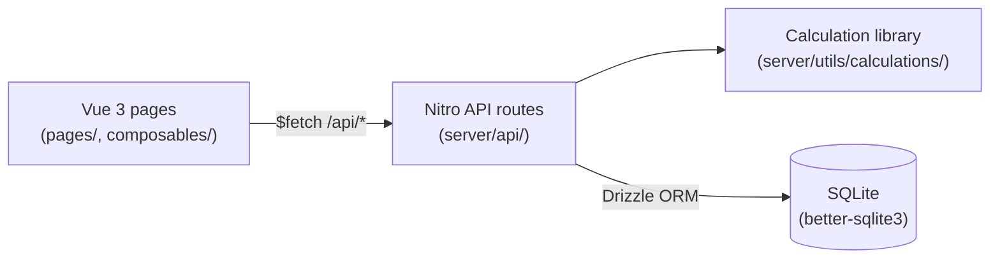

# BrewBuddyNG — Technical documentation

This document is the developer-facing guide for BrewBuddyNG. For non-developer install instructions,
see the [README](../README.md).

## Table of contents

- [BrewBuddyNG — Technical documentation](#brewbuddyng--technical-documentation)
  - [Table of contents](#table-of-contents)
  - [Architecture overview](#architecture-overview)
  - [Local development setup](#local-development-setup)
  - [Project structure](#project-structure)
  - [Server layer](#server-layer)
    - [CRUD factories](#crud-factories)
    - [Validation](#validation)
    - [Recipes and brews](#recipes-and-brews)
  - [Calculation library](#calculation-library)
  - [Database schema](#database-schema)
  - [API reference](#api-reference)
  - [Configuration](#configuration)
  - [Testing](#testing)
  - [Linting and formatting](#linting-and-formatting)
  - [Building and deployment](#building-and-deployment)

## Architecture overview

BrewBuddyNG is a single Nuxt 3 application that serves both the Vue 3 front end and a Nitro-based REST
API from one process.



Key design points:

- **One process, file-based routing.** Pages under `pages/` and API handlers under `server/api/`
  are auto-routed by Nuxt/Nitro.
- **Shared types.** Domain types are inferred directly from the Drizzle schema in
  [`types/index.ts`](../types/index.ts), so the database is the single source of truth.
- **Validated boundaries.** Every write endpoint validates its body with Zod schemas derived from
  the schema via `drizzle-zod` (see [`server/utils/validation.ts`](../server/utils/validation.ts)).
- **DRY CRUD.** Simple resource endpoints are generated by factory helpers in
  [`server/utils/crud.ts`](../server/utils/crud.ts).

## Local development setup

Prerequisites: **Node.js 22** and npm.

```bash
npm install          # installs deps and runs `nuxt prepare`
npm run db:seed      # optional: load standard ingredient data into ./data/brewbuddy.db
npm run dev          # start dev server at http://localhost:3000
```

Useful scripts (defined in [`package.json`](../package.json)):

| Script                | Purpose                              |
| --------------------- | ------------------------------------ |
| `npm run dev`         | Dev server with hot reload           |
| `npm run build`       | Production build (`.output/`)        |
| `npm run preview`     | Preview the production build         |
| `npm run db:seed`     | Seed the database from `seed/*.xml`  |
| `npm run db:generate` | Generate Drizzle migrations          |
| `npm run db:migrate`  | Apply Drizzle migrations             |
| `npm run lint`        | Run ESLint                           |
| `npm run lint:fix`    | Run ESLint with autofix              |
| `npm run format`      | Format all files with Prettier       |
| `npm run typecheck`   | Type-check with `vue-tsc`            |
| `npm run test`        | Run Vitest in watch mode             |
| `npm run test:run`    | Run the test suite once (used in CI) |

## Project structure

```markdown
app.vue # Root component
nuxt.config.ts # Nuxt configuration
drizzle.config.ts # Drizzle Kit configuration
vitest.config.ts # Test configuration
eslint.config.mjs # ESLint flat config (Nuxt + Prettier)

types/index.ts # Shared domain types (inferred from schema)
composables/ # Auto-imported Vue composables (e.g. useResourceCrud)
layouts/ # App layout (sidebar)
pages/ # File-based routed Vue pages
i18n/locales/ # nl.json, en.json
assets/css/ # Tailwind entry

server/
api/ # REST API route handlers
db/
schema.ts # Drizzle table definitions
index.ts # useDB() singleton (WAL, foreign keys on)
seed.ts # XML → DB seeding script
plugins/database.ts # Ensures the DB/data dir exists on startup
utils/
crud.ts # defineCollectionHandler / defineItemHandler factories
validation.ts # Zod schemas derived via drizzle-zod
calculations/ # Pure brewing calculation functions

seed/ # BeerXML seed data
tests/ # Vitest tests
```

## Server layer

### CRUD factories

[`server/utils/crud.ts`](../server/utils/crud.ts) exposes two helpers that remove repetitive
boilerplate from resource endpoints:

- `defineCollectionHandler(table, { createSchema })` — handles `GET` (list) and `POST` (create,
  returns `201`). Unsupported methods return `405`.
- `defineItemHandler(table, { updateSchema })` — handles `GET`, `PUT`, and `DELETE` by `id`. Returns
  `404` for missing rows and `400` for an invalid id.

The seven simple ingredient resources (`fermentables`, `hops`, `yeasts`, `miscs`, `waters`,
`equipment`, `styles`) are implemented purely through these factories. Each `index.ts` and `[id].ts`
just supplies its table and validation schema.

### Validation

[`server/utils/validation.ts`](../server/utils/validation.ts) builds insert/update schemas with
`createInsertSchema()` from `drizzle-zod`. Update variants use `.partial()`. Server-managed fields
(`id`, `createdAt`, `updatedAt`, `recipeId`, `brewId`) are omitted so they cannot be set by clients.
Handlers validate request bodies with `readValidatedBody(event, (b) => schema.parse(b))`.

### Recipes and brews

Recipes and brews are aggregate resources with child rows (ingredients, measurements, checklist).
Their handlers:

- Load children in parallel with `Promise.all`.
- On update, replace child collections wholesale, re-injecting the parent id server-side so child
  rows never carry stale `id`/`recipeId` values.

## Calculation library

All brewing math lives in [`server/utils/calculations/`](../server/utils/calculations) as pure,
side-effect-free functions, which makes them easy to unit test. Modules: `gravity`, `abv`, `ibu`,
`color`, `carbonation`, `refractometer`, `efficiency`, `temperature`, `water`, `yeast`, with a
barrel `index.ts`.

IBU utilisation tables (Rager, Garetz, Noonan) are expressed as data-driven step tables looked up by
a shared `stepLookup()` helper rather than long `if/else` chains.

## Database schema

SQLite via Drizzle ORM. The schema in [`server/db/schema.ts`](../server/db/schema.ts) defines 18
tables:

- Ingredient/reference: `fermentables`, `hops`, `yeasts`, `miscs`, `waters`, `equipment`,
  `beerStyles`, `mashProfiles`, `mashSteps`
- Recipes: `recipes` plus child tables `recipeFermentables`, `recipeHops`, `recipeYeasts`,
  `recipeMiscs`, `recipeWaters`
- Brews: `brews`, `brewMeasurements`, `brewChecklist`
- App: `settings`

`useDB()` ([`server/db/index.ts`](../server/db/index.ts)) returns a singleton connection with WAL
mode and `foreign_keys` enabled.

## API reference

| Method         | Endpoint                             | Description                     |
| -------------- | ------------------------------------ | ------------------------------- |
| GET/POST       | `/api/fermentables`                  | List / create fermentables      |
| GET/PUT/DELETE | `/api/fermentables/:id`              | Get / update / delete           |
| GET/POST       | `/api/hops`                          | List / create hops              |
| GET/POST       | `/api/yeasts`                        | List / create yeasts            |
| GET/POST       | `/api/miscs`                         | List / create misc ingredients  |
| GET/POST       | `/api/waters`                        | List / create water profiles    |
| GET/POST       | `/api/equipment`                     | List / create equipment         |
| GET/POST       | `/api/styles`                        | List / create beer styles       |
| GET/POST       | `/api/recipes`                       | List / create recipes           |
| GET/PUT/DELETE | `/api/recipes/:id`                   | Full recipe with ingredients    |
| POST           | `/api/recipes/:id/calculate`         | Recalculate OG/FG/IBU/color/ABV |
| GET/POST       | `/api/brews`                         | List / create brews             |
| GET/PUT/DELETE | `/api/brews/:id`                     | Brew with measurements          |
| POST           | `/api/brews/:id/measurements`        | Add measurement                 |
| GET/PUT        | `/api/settings`                      | Application settings            |
| GET            | `/api/health`                        | Health check (used by Docker)   |
| POST           | `/api/calculations/hop-wizard`       | IBU/hop amount calculation      |
| POST           | `/api/calculations/water-adjustment` | Water chemistry                 |
| POST           | `/api/calculations/yeast-starter`    | Yeast propagation               |
| POST           | `/api/calculations/refractometer`    | Brix to SG                      |
| POST           | `/api/calculations/carbonation`      | CO₂ pressure/priming            |

## Configuration

Runtime configuration is defined in [`nuxt.config.ts`](../nuxt.config.ts) under `runtimeConfig`:

| Setting        | Env variable         | Default               | Description              |
| -------------- | -------------------- | --------------------- | ------------------------ |
| `databasePath` | `NUXT_DATABASE_PATH` | `./data/brewbuddy.db` | SQLite database location |

The Docker image sets `NUXT_DATABASE_PATH=/data/brewbuddy.db` and mounts the `brewbuddy-data` volume
at `/data` for persistence. The seed script reads `DATABASE_PATH` (defaulting to the same path) when
run directly.

## Testing

Tests use [Vitest](https://vitest.dev/) and live in `tests/`. Configuration is in
[`vitest.config.ts`](../vitest.config.ts) (node environment, v8 coverage over `server/utils/**`,
with `~`/`@` aliases pointing at the project root).

```bash
npm run test:run      # run once
npm run test          # watch mode
```

Current coverage focuses on the pure calculation library (gravity, ABV, IBU, colour, carbonation,
refractometer) and the server validation schemas.

## Linting and formatting

- **ESLint** uses the Nuxt flat config (`@nuxt/eslint`) combined with `eslint-config-prettier` so
  formatting is delegated to Prettier. See [`eslint.config.mjs`](../eslint.config.mjs).
- **Prettier** settings live in [`.prettierrc`](../.prettierrc).

```bash
npm run lint          # check
npm run lint:fix      # autofix
npm run format        # format with Prettier
```

## Building and deployment

The [`Dockerfile`](../Dockerfile) is a multi-stage Node 22 Alpine build:

1. **builder** stage installs dependencies and runs `npm run build`.
2. The runtime stage copies `.output` and `seed`, sets `NUXT_DATABASE_PATH`, exposes port 3000, and
   adds a health check hitting `/api/health`.

Run it with Docker Compose:

```bash
docker compose up --build
```

This publishes the app on port 3000 and persists data in the `brewbuddy-data` volume.
